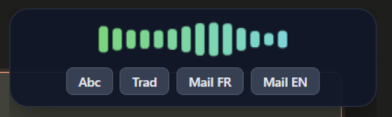
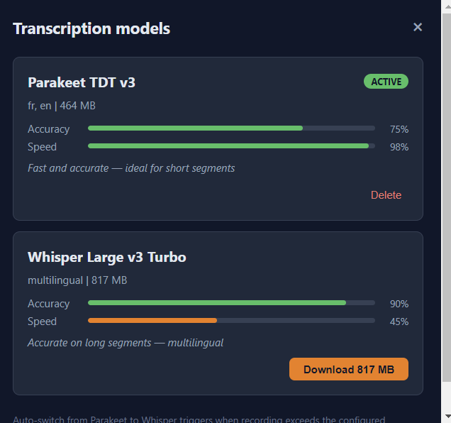

<p align="center">
  <!-- Replace with your actual logo when ready -->
  
</p>

<h1 align="center">Dikto</h1>

<p align="center">
  <strong>Speak. Translate. Rewrite. Instantly, from any app.</strong>
</p>

<p align="center">
  <a href="https://github.com/david-digitis/dikto/releases"></a>
  <a href="https://github.com/david-digitis/dikto/blob/main/LICENSE"></a>
  
  
  
</p>

<p align="center">
  A desktop push-to-talk dictaphone that transcribes your voice in <strong>~50ms</strong> — entirely on your machine, without sending a single byte of audio to the cloud.<br>
  Need more? One click corrects your grammar, translates to another language, or rewrites your text as a professional email.<br>
  Works in <strong>any text field</strong>, in <strong>any application</strong>. Hold, speak, release, done.
</p>

<p align="center">
  
</p>

<!-- When you have a demo GIF/video, uncomment this:
<p align="center">
  <a href="https://youtu.be/YOUR_DEMO_VIDEO">
    
  </a>
  <br>
  <em>Hold Ctrl+Space, speak, click "Abc", release. Corrected text appears where your cursor is.</em>
</p>
-->

---

## :zap: Features at a Glance

| Feature | What it does |
|---------|-------------|
| **Push-to-talk dictation** | Hold `Ctrl+Space`, speak, release. Text appears at your cursor. Any app. |
| **~50ms local transcription** | Dual STT engine — Parakeet TDT v3 for speed, Whisper Turbo for accuracy. |
| **100% offline voice processing** | Your audio never leaves your machine. Period. |
| **AI-powered rewriting** | Correct grammar, translate, turn dictation into a polished email — one click. |
| **Double Ctrl+C overlay** | Select text anywhere, double-tap Ctrl+C, get translation/correction in an overlay. |
| **Custom action modes** | Create your own Gemini prompts: summarize, simplify, code review, anything. |
| **Clipboard manager** | 100-entry history with search, keyboard navigation, image support. |
| **Cross-platform** | Windows 11 + Linux (Fedora/Wayland). Portable .exe or AppImage. |

---

## :studio_microphone: Dictation — Just Talk, It Types

Hold `Ctrl+Space`, speak, release. Your words appear wherever your cursor is — any text field, any app. Transcription runs entirely on your machine using [sherpa-onnx](https://github.com/k2-fsa/sherpa-onnx), with no internet needed.

**~50ms latency.** That's faster than your fingers leaving the keyboard.

Two STT models, automatically selected based on recording length:

| Model | Speed | Best for |
|-------|-------|----------|
| **Parakeet TDT v3** | ~50-100ms | Short phrases, quick commands |
| **Whisper Large v3 Turbo** | ~2-3s | Long dictations, higher accuracy |

The switch threshold is adjustable from the tray menu (default: 10s). Download models directly from the built-in model manager.

<p align="center">
  
</p>

---

## :globe_with_meridians: Smart Translate — Like DeepL, But Built-in

Click the **Trad** button while dictating, or select existing text and double `Ctrl+C`. Dikto detects the source language and translates bidirectionally:

- You speak French? It translates to English.
- You select English text? It translates to French.
- No copy-paste into a separate app. No switching windows.

Supported languages: French, English, German, Spanish, Italian, Portuguese, Dutch.

<p align="center">
  
</p>

---

## :sparkles: AI Actions — Correction, Emails, Custom Prompts

During recording, action buttons slide in on the bubble. Click one before you release:

| Button | What it does |
|--------|-------------|
| *(none)* | Raw transcription — pasted as-is |
| **Abc** | Fix grammar, spelling & punctuation |
| **Trad** | Smart translate (auto-detect direction) |
| **Mail FR / EN** | Turn your dictation into a professional email with signature |
| **Your own** | Create custom modes with your own Gemini prompts |

> **Privacy note**: Your voice never leaves your machine — only the already-transcribed text is sent to Gemini for AI processing. And only when you explicitly click an action button.

---

## :keyboard: Double Ctrl+C — AI Overlay for Existing Text

Select text in **any application**, hit `Ctrl+C` twice quickly (< 400ms). An overlay appears with the same action buttons — translate, correct, or rewrite any existing text without re-typing it.

Think of it as a system-wide DeepL + Grammarly + email assistant that activates with a double copy.

<p align="center">
  
</p>

---

## :art: Custom Action Modes

The default modes (Abc, Mail FR, Mail EN) are just the starting point. Open the modes editor from the tray menu to create your own — each mode is a label + a Gemini prompt.

**Ideas**: Summarize in 3 points. Make it formal. Translate to Japanese. Fix code comments. Extract action items. Explain like I'm five. Whatever your workflow needs.

<p align="center">
  
</p>

---

## :wrench: Everything Lives in the Tray

Right-click the system tray icon. No config files to edit, no command line, no separate settings app.

- Select your microphone
- Download and manage STT models
- Edit action modes
- Toggle Gemini auto-correction
- Adjust the Whisper switch threshold
- Set native/target languages
- Configure your Gemini API key (stored encrypted)
- Enable start at login

<p align="center">
  
</p>

---

## :thinking: Why Dikto?

| You might have tried... | What's missing |
|------------------------|----------------|
| **Whisper.cpp / CLI tools** | No GUI, no auto-paste, no AI rewriting, manual model management |
| **Windows Speech Recognition** | No AI correction, no translation, limited accuracy, no custom prompts |
| **Ditto / clipboard managers** | No dictation, no AI processing, no translation |
| **DeepL desktop app** | No dictation, no clipboard manager, no custom prompts, separate window |
| **ChatGPT / Copilot** | No push-to-talk, no auto-paste at cursor, requires window switching |

Dikto combines **local speech-to-text**, **AI text processing**, and **system-wide clipboard integration** into a single tray app. Press a shortcut, talk, get results where you need them.

---

## :rocket: Quick Start

### 1. Download

Grab the latest release for your platform from the [Releases page](https://github.com/david-digitis/dikto/releases):

| Platform | Format | Size |
|----------|--------|------|
| Windows | `.exe` portable (no install) | ~76 MB |
| Windows | NSIS installer (start-at-login) | ~83 MB |
| Linux | `.AppImage` | ~114 MB |

### 2. Launch and onboard

The first-launch wizard walks you through:
1. Enter your **Gemini API key** (free at [aistudio.google.com](https://aistudio.google.com/)) — stored encrypted
2. Select your **microphone**
3. Review the **keyboard shortcuts**

> Dictation works without a Gemini key. You only need one for translation, correction, and AI actions.

### 3. Download an STT model

From the tray menu, open **STT Models** and download Parakeet TDT v3 (464 MB). That's it — you're ready to dictate.

---

## :hammer_and_wrench: Build from Source

**Prerequisites**: [Node.js 18+](https://nodejs.org/) and npm.

```bash
git clone https://github.com/david-digitis/dikto.git
cd dikto
npm install
npx electron .
```

> **Important**: Do not launch from the VS Code integrated terminal — it sets `ELECTRON_RUN_AS_NODE` which prevents Electron from starting. Use a system terminal.

### Build distributable packages

```bash
# Windows (.exe portable + NSIS installer)
npm run build:win

# Linux (.AppImage)
npm run build:linux
```

### Linux prerequisites (Fedora / Wayland)

```bash
sudo dnf install dotool fuse-libs
sudo systemctl enable --now dotool.service
sudo usermod -aG input $USER   # logout/login required
```

Install the GNOME extension **[AppIndicator and KStatusNotifierItem Support](https://extensions.gnome.org/extension/615/appindicator-support/)** for the tray icon.

---

## :lock: Privacy

| What | Where it goes |
|------|---------------|
| **Your voice & audio** | Nowhere. Transcription is 100% local via sherpa-onnx. |
| **Transcribed text** | Sent to Google Gemini **only** when you click an AI action (translate, correct, email). Raw dictation never touches the network. |
| **API key** | Stored encrypted via Electron's safeStorage. Never logged, never exposed in config files. |

No telemetry. No analytics. No account required. Your data stays on your machine.

---

## :gear: Tech Stack

| Component | Technology |
|-----------|-----------|
| Framework | Electron 33 |
| Local STT | [sherpa-onnx-node](https://github.com/k2-fsa/sherpa-onnx) (Parakeet TDT v3 + Whisper Turbo) |
| AI processing | [Gemini 2.5 Flash Lite](https://ai.google.dev/) (optional, cloud) |
| System hotkeys | uiohook-napi (Windows) / evdev (Linux/Wayland) |
| Auto-paste | VBScript (Windows) / dotool (Linux/Wayland) |

**2 runtime dependencies.** No Python, no Docker, no local LLM server, no heavyweight frameworks.

---

## :world_map: Roadmap

- [ ] macOS support
- [ ] GPU acceleration for STT (CUDA / Metal)
- [ ] More STT models (multilingual, specialized)
- [ ] Plugin system for custom actions beyond Gemini
- [ ] Dictation history with search
- [ ] Floating always-on-top mini recorder
- [ ] Voice commands ("correct that", "translate this")
- [ ] Auto-update mechanism

Have an idea? [Open an issue](https://github.com/david-digitis/dikto/issues) — feature requests are welcome.

---

## :earth_africa: Language Support

The app interface is in **English**. Dictation and AI processing support **French natively** (the developer uses it daily in French), along with English, German, Spanish, Italian, Portuguese, and Dutch.

The STT models (Parakeet, Whisper) support English and French out of the box. Whisper Turbo is multilingual and handles additional languages.

---

## :handshake: Contributing

Contributions are welcome! Whether it's a bug fix, a new feature, or a documentation improvement.

1. Fork the repo
2. Create a feature branch (`git checkout -b feature/my-awesome-thing`)
3. Make your changes
4. Test on your platform (Windows or Linux)
5. Open a pull request

No formal process — just open a PR and let's talk about it.

---

## :star2: Credits

- **[sherpa-onnx](https://github.com/k2-fsa/sherpa-onnx)** by k2-fsa — the blazing-fast local STT engine that makes offline dictation possible
- **[NVIDIA Parakeet TDT](https://huggingface.co/nvidia/parakeet-tdt-0.6b-v2)** — the ~50ms model that makes push-to-talk feel instant
- **[OpenAI Whisper](https://github.com/openai/whisper)** — the accuracy benchmark for longer dictations
- **[Google Gemini](https://ai.google.dev/)** — AI processing for translation, correction, and custom actions
- **[Electron](https://www.electronjs.org/)** — cross-platform desktop framework
- **[uiohook-napi](https://github.com/SergioRt1/uiohook-napi)** — native system-wide hotkeys

---

## :page_facing_up: License

MIT -- [LICENSE](LICENSE)

Built by David at [Digitis](https://digitis.cloud).

---

<p align="center">
  <em>If Dikto saves you time, consider giving it a :star: on GitHub. It helps others discover the project.</em>
</p>
